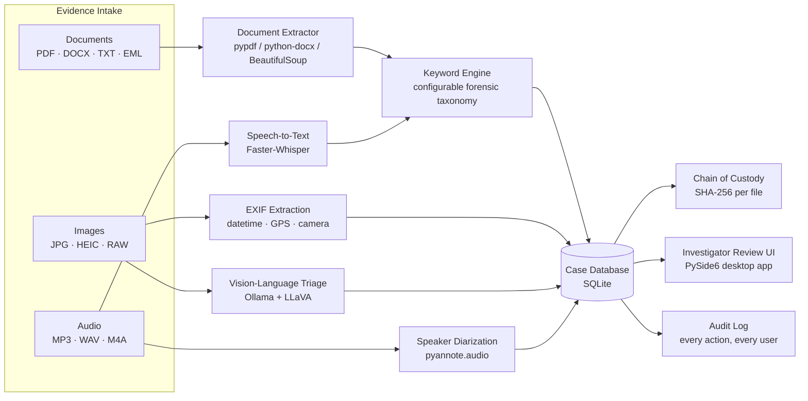

# Virgil — Forensic Media Analysis Pipeline

**Built for Williamson County Law Enforcement.** An on-premises pipeline that transcribes audio, triages images with a vision-language model, and parses documents for investigative keywords — with SHA-256 chain of custody and a full audit trail on every action.

> Code lives in a private repository (available on request/for review). This page describes the problem, the architecture, and the engineering decisions behind it.

---

## At a glance

| | |
|---|---|
| **Client** | Williamson County Law Enforcement |
| **Context** | Spring 2026, AI Dev Enterprise capstone |
| **My role** | **[ADD: solo build / your role on the team]** |
| **Status** | **[ADD: course deliverable / pilot with the department / in active use]** |
| **Stack** | Python, PySide6, SQLite, Faster-Whisper, pyannote.audio, Ollama (LLaVA), bcrypt |

---

## The problem

Investigators accumulate evidence — scanned documents, seized-device images, recorded interviews and calls — faster than anyone can manually review it. Each format needs a different kind of triage (read the doc, look at the image, listen to the audio), there's no consistent way to search across all of it for case-relevant terms, and every step needs to be defensible in court: who touched the file, when, and did it change.

Virgil centralizes that intake into one desktop tool, run entirely on department hardware — nothing leaves the building.

## Architecture

Every module runs locally — no evidence file or transcript is ever sent to a third-party API. That constraint drove most of the interesting decisions below.

## Stack & models

| Layer | Technology | Why |
|---|---|---|
| Audio transcription | **Faster-Whisper** | CTranslate2-backed Whisper reimplementation — meaningfully faster on CPU, which matters when there's no guaranteed GPU on-site |
| Speaker diarization | **pyannote.audio 3.1** | Separates `SPEAKER_00` / `SPEAKER_01` in multi-person recordings (interviews, recorded calls) |
| Image analysis | **Ollama running LLaVA** (local vision-language model) | Scene description + content triage without sending images to a cloud vision API — non-negotiable for chain-of-custody evidence |
| Tone/sentiment | **VADER** | Lightweight tone labeling (Positive/Calm/Neutral/Tense/Angry) on transcript segments |
| Document parsing | pypdf, python-docx, BeautifulSoup, `filetype` | Multi-format text extraction (PDF, DOCX, TXT, HTML, EML) into a common pipeline |
| Storage | SQLite + bcrypt | Thread-safe local DB; per-investigator accounts, hashed passwords, lockout after 5 failed logins |
| UI | PySide6 | Native desktop app — no browser, no server, runs fully offline |

## What it does

- **Case management** — auto-generated case IDs, every piece of evidence tied to a case with a SHA-256 hash recorded at ingest
- **Document scanning** — extracts text across common formats and scans it against a configurable, categorized forensic keyword taxonomy
- **Audio transcription** — Whisper transcription with optional speaker diarization, then keyword-scanned like any other text
- **Image triage** — EXIF metadata (time, GPS, camera) plus AI-generated scene descriptions; images are blurred by default and only revealed on investigator action. The vision model is prompted to flag only content it can point to directly — no speculation — across categories like weapons, violence, drug activity, and exploitative material, so investigators get a shortlist to review, not a black-box verdict
- **Case library & audit log** — every analysis, login, and case action is timestamped and attributed to an investigator

## Engineering decisions worth calling out

**Local inference, no exceptions.** The single hardest constraint was that evidence can't leave department hardware. That ruled out any cloud STT or vision API and pushed the whole stack toward Faster-Whisper + Ollama running locally — which then cascaded into real deployment problems (CUDA/PyTorch version pinning, FFmpeg builds, Python 3.12 vs. 3.13 wheel availability) that ended up being a big share of the actual engineering time.

**Prompting a vision model for evidentiary use is not the same as prompting one for a chatbot.** Hallucinated content flags are a real liability in a forensic context, so the image-analysis prompt is deliberately conservative: low temperature (0.1), an explicit "describe only what's directly visible, do not infer" instruction, and a structured output format the parser can reliably split into a scene description and a flag list. Anything the model hedges on (`"not clearly visible"`, `"no evidence of"`) is filtered out rather than surfaced as a flag.

**Accountability by design.** Multi-user auth plus an append-only audit log means every action is attributed to a specific investigator — a requirement once you're producing anything that might end up referenced in a case file, not just a nice-to-have.

**Defensible chain of custody.** SHA-256 hashing happens at ingest and is stored alongside every evidence record, so file integrity can be verified later without relying on the OS's file metadata.

## Sample output

**[ADD SCREENSHOTS HERE — see notes below]**

Suggested captures, each with case numbers/names/real evidence redacted or replaced with demo data first:
- Case dashboard / case library view
- Document panel showing a keyword hit with surrounding context
- Image panel: blurred thumbnail → revealed → AI scene description + flags
- Transcription panel: diarized transcript with timestamps and tone labels
- Audit log view

## Results

**[ADD: fill this in with anything real you have — e.g. "processed N cases during the pilot," "cut manual document review from X to Y," instructor/client feedback, or just leave this section out if there's nothing quantitative yet. Don't guess at numbers — an honest "still in pilot with the department" line reads better to recruiters than a vague stat.]**

---

### A note on scope

This write-up covers the forensic evidence suite specifically. Access to the private repo is available on request.
